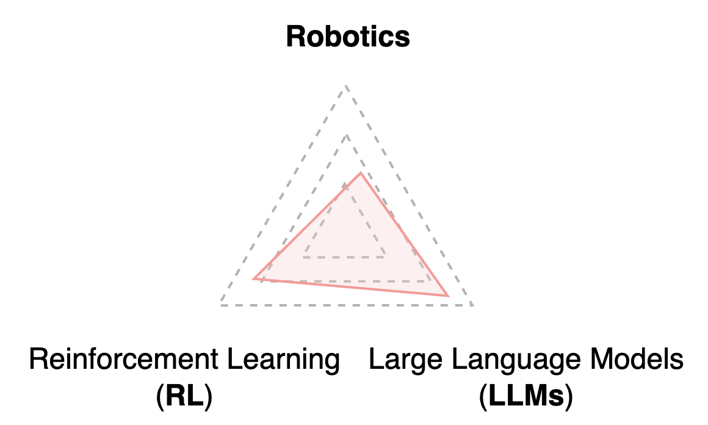



My interests are in a <ins>"research triangle"</ins>:



- **Large language models** have high capacities to reason universally
- **Reinforcement learning** optimize agent behavior to maximize expectations
- **Robots embody** the intellegence to our real world

---
